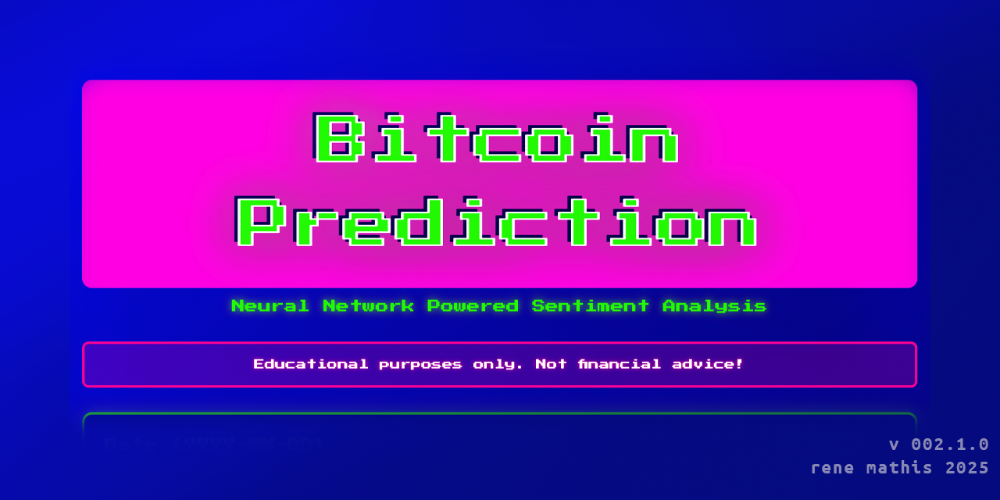

# Bitcoin Prediction



> **Neural Network Powered Sentiment Analysis**  
> Educational machine learning project for Bitcoin market sentiment prediction

[](https://rm-r3.github.io/bitcoin-prediction/)
[](LICENSE)

## 🎯 Overview

Bitcoin Prediction is an educational machine learning application that uses a neural network to classify Bitcoin market sentiment based on historical price and volume data. The model categorizes market conditions into five sentiment classes: **Extreme Fear**, **Fear**, **Neutral**, **Greed**, and **Extreme Greed**.

**🔗 [Try the Live Demo](https://rm-r3.github.io/bitcoin-prediction/)**

## ✨ Features

- 🧠 **Neural Network Classification** - Custom-trained ML5.js model
- 📊 **Real-Time Data Fetching** - Multiple API fallbacks (CoinGecko, CryptoCompare, Blockchain.info)
- 🎨 **Retro Cyberpunk Design** - Neon aesthetics with smooth animations
- 📱 **Fully Responsive** - Works on desktop, tablet, and mobile
- ⚡ **Client-Side Training** - Model trains in your browser
- 🎯 **Confidence Scores** - Shows prediction confidence percentages

## 🛠️ Tech Stack

- **ML5.js** - Machine Learning library (built on TensorFlow.js)
- **p5.js** - Creative coding framework
- **Vanilla JavaScript** - No frameworks, pure JS
- **CSS3** - Custom animations and styling
- **HTML5** - Semantic markup

## 📊 How It Works

### Training Data
- **Dataset**: 1,885 historical Bitcoin data points (2018-2024)
- **Features**: Date, Price (USD), 24h Volume (USD)
- **Labels**: 5 sentiment categories based on Fear & Greed Index

### Model Architecture
- **Type**: Feedforward Neural Network (FNN)
- **Input Layer**: 3 neurons (date, volume, rate)
- **Hidden Layer**: ~16 neurons (auto-configured)
- **Output Layer**: 5 neurons (sentiment classes)
- **Training**: 32 epochs, batch size 32
- **Activation**: ReLU (hidden), Softmax (output)

### Sentiment Categories
| Category | Description | Recommendation |
|----------|-------------|----------------|
| 🔥 **Extreme Fear** | Market panic | Strong buy signal |
| 😰 **Fear** | Market uncertainty | Good entry point |
| 😐 **Neutral** | Market balance | Hold position |
| 😎 **Greed** | Market optimism | Consider profits |
| 🤑 **Extreme Greed** | Market euphoria | Sell signal |

## 🚀 Quick Start

### Prerequisites
- Modern web browser (Chrome, Firefox, Safari, Edge)
- Internet connection (for API and CDN libraries)

### Local Development

1. **Clone the repository**
   ```bash
   git clone https://github.com/rm-r3/bitcoin-prediction.git
   cd bitcoin-prediction
   ```

2. **Start a local server**
   
   **Option 1: Python**
   ```bash
   python -m http.server 5503
   ```
   
   **Option 2: Node.js**
   ```bash
   npx http-server -p 5503
   ```
   
   **Option 3: VS Code**
   - Install "Live Server" extension
   - Right-click `index.html` > "Open with Live Server"

3. **Open in browser**
   ```
   http://localhost:5503
   ```

### Usage

1. **Fetch Live Data** (optional)
   - Click "Fetch Live Data" to auto-populate with current BTC price and volume
   - Or manually enter values

2. **Train the Model**
   - Click "Train Model" 
   - Wait 20-40 seconds for training to complete
   - Watch progress in status messages

3. **Make Predictions**
   - Adjust date/price/volume if desired
   - Click "Predict"
   - View sentiment prediction with confidence score

## 📁 Project Structure

```
bitcoin-prediction/
├── index.html                          # Main HTML file
├── sketch.js                           # Main JavaScript logic
├── style.css                           # Styling and animations
├── dataset_btc_fear_greed_copy.csv    # Training dataset
├── favicon_btc_96x96.png              # Favicon
├── assets/
│   └── cover.png                       # Repository cover image
└── README.md                           # This file
```

## 🎨 Design Philosophy

The retro cyberpunk aesthetic was chosen to:
- Create a memorable visual identity
- Stand out in portfolios
- Pay homage to early internet/gaming culture
- Demonstrate CSS animation skills

**Color Palette**:
- 🟣 Neon Pink (#ff00ea)
- 🟢 Lime Green (#31fa03)
- 🔵 Electric Blue (#0808e4)
- 🟣 Dark Purple (#0a025e)

## ⚠️ Important Disclaimer

**THIS IS AN EDUCATIONAL PROJECT**

- ❌ **NOT financial advice** - Do not use for real investments
- ❌ **No guarantees** - Past performance ≠ future results
- ❌ **High volatility** - Crypto markets are extremely unpredictable
- ✅ **Always DYOR** - Do Your Own Research before investing
- ✅ **Consult professionals** - Speak to financial advisors

## 🐛 Known Issues & Limitations

### API Limitations
- Free API tiers have rate limits
- CORS may prevent API access in some environments
- App gracefully falls back to sample data if APIs fail

### Model Limitations
- Training happens client-side (depends on device speed)
- Model retrains each session (no persistence yet)
- Limited to historical data patterns (2018-2024)
- Cannot predict black swan events

### Browser Compatibility
- Requires modern browser with ES6+ support
- WebGL required for ML5.js
- May be slow on older devices

## 🔄 Future Enhancements

- [ ] Model persistence (save/load trained models)
- [ ] Historical chart visualization (Chart.js)
- [ ] Multiple cryptocurrency support
- [ ] Technical indicators integration (RSI, MACD, etc.)
- [ ] Sentiment analysis from news/social media
- [ ] Price change predictions (regression model)
- [ ] Export predictions to CSV
- [ ] Dark mode toggle
- [ ] Multi-language support

## 📚 Learning Resources

- [ML5.js Documentation](https://learn.ml5js.org/)
- [p5.js Reference](https://p5js.org/reference/)
- [Neural Networks Explained](https://www.youtube.com/watch?v=aircAruvnKk)
- [Bitcoin Fear & Greed Index](https://alternative.me/crypto/fear-and-greed-index/)

## 🤝 Contributing

Contributions are welcome! Feel free to:
- Report bugs
- Suggest features
- Submit pull requests
- Improve documentation

## 📄 License

This project is open source and available under the [MIT License](LICENSE).

## 👨‍💻 Author

**René Mathis**

- GitHub: [@rm-r3](https://github.com/rm-r3)
- Portfolio: https://www.mathis-conceptdesign-portfolio.com
- LinkedIn: www.linkedin.com/in/rene-mathis-conceptdesign 

## 🙏 Acknowledgments

- **ML5.js** team for the amazing machine learning library
- **p5.js** community for creative coding tools
- **CoinGecko** for free cryptocurrency API
- **Bitcoin Fear & Greed Index** for sentiment data methodology

## 📊 Project Stats

- **Training Dataset**: 1,885 data points
- **Time Period**: 2018-2024 (6 years)
- **Model Accuracy**: ~70-75% (varies by market conditions)
- **Training Time**: 20-40 seconds (depends on device)
- **Lines of Code**: ~700 LOC

---

**⭐ If you found this project interesting, please consider giving it a star!**

**🚀 [Try the Live Demo Now](https://rm-r3.github.io/bitcoin-prediction/)**

---

*Built with 💚 for learning and education. Not for actual trading!*